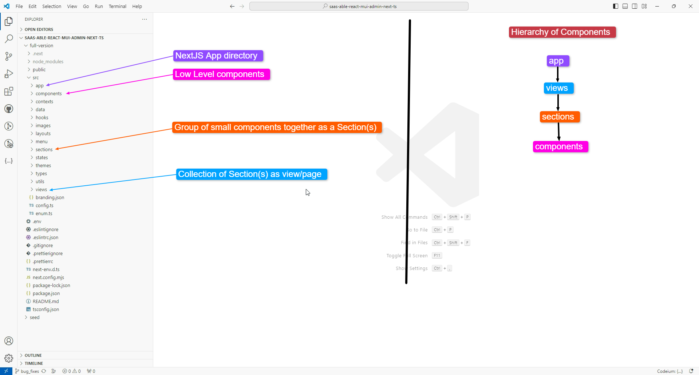
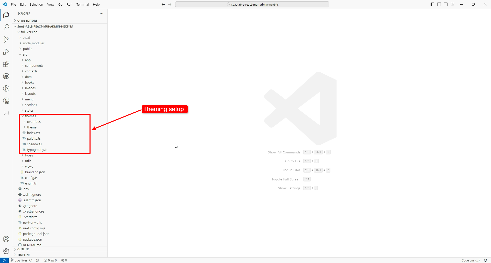
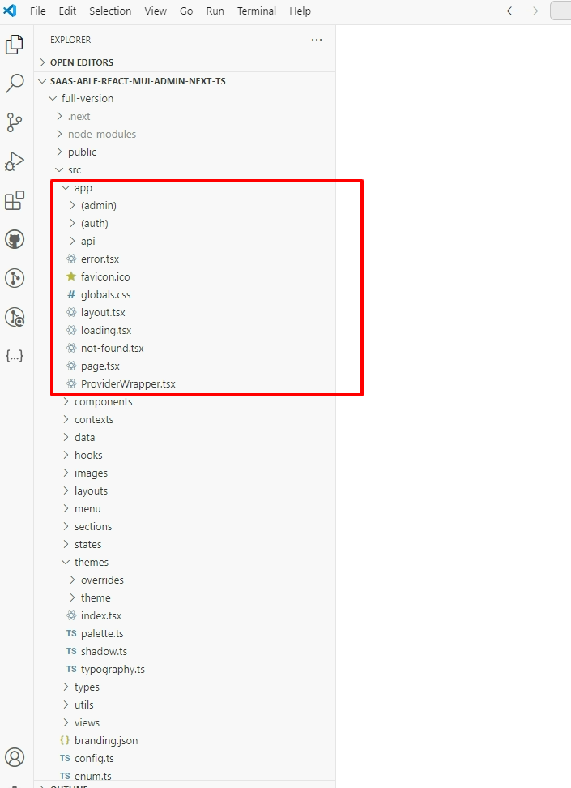
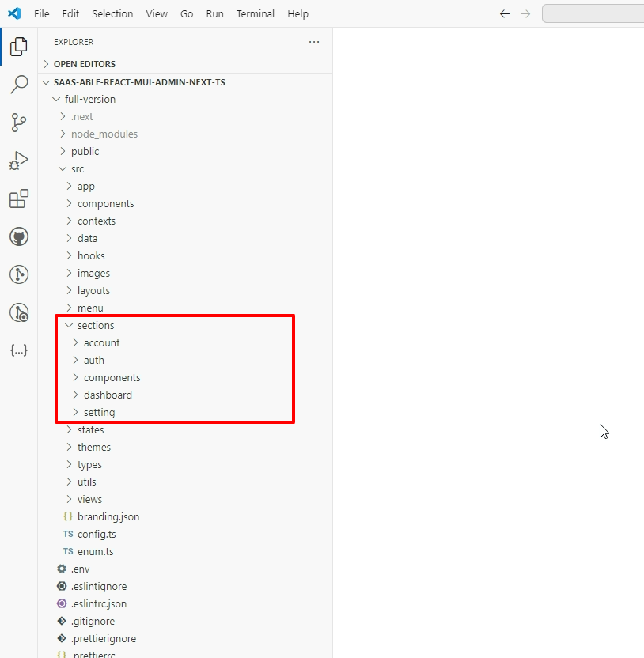
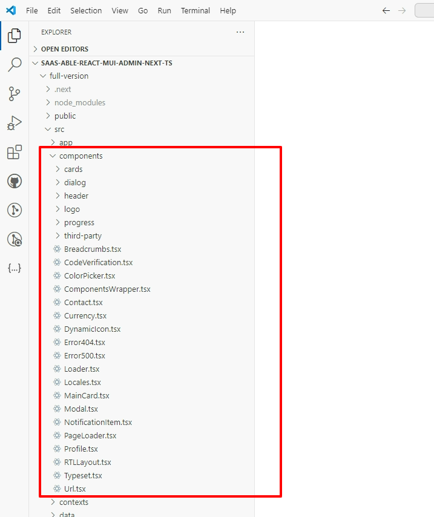

# Folder Structure

<figure><figcaption></figcaption></figure>

View folders contain actual themes:

<figure><figcaption></figcaption></figure>

For a more detailed snapshot of the main folders, please check below:

App

Sections

Components

