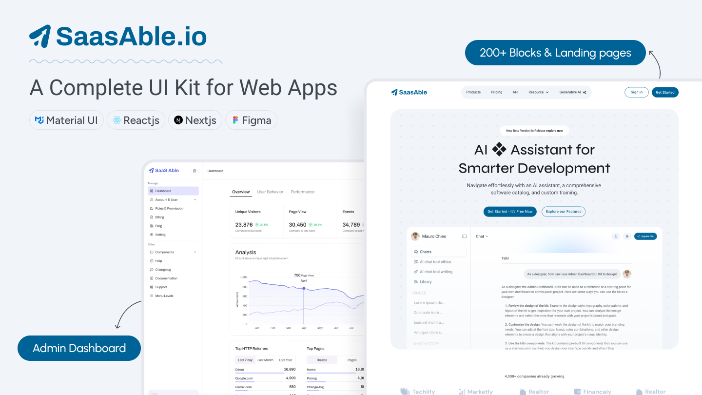

# Introduction

<figure><figcaption>
SaasAble - UI Kit and Dashboard Template
</figcaption></figure>

We're excited to introduce SaasAble - A Complete UI Solution for your web app even if you need Marketing Landing Pages or Admin Interface. SaaS Able covers both. So that you can focus on core business instead of sites. Following are two separate docs for you for each project.

Jump to specific docs here ⤵

<table data-view="cards"><thead><tr><th></th><th></th><th></th><th data-hidden data-card-target data-type="content-ref"></th><th data-hidden data-card-cover data-type="files"></th></tr></thead><tbody><tr><td><a href="https://phoenixcoded.gitbook.io/saasable/ui-kit-v1.3.0">UI KIT</a></td><td></td><td></td><td><a href="https://app.gitbook.com/o/-LnuU-VL0Ii_p0-bShNe/s/qzhBzJakUXsoGTJarvBa/">UI-Kit - V1.0.0</a></td><td><a href=".gitbook/assets/UI Kit.png">UI Kit.png</a></td></tr><tr><td><a href="https://phoenixcoded.gitbook.io/saasable/admin-v1.3.0">Admin Template</a></td><td></td><td></td><td><a href="https://app.gitbook.com/o/-LnuU-VL0Ii_p0-bShNe/s/EzwmQZJZlGbhO98ACbMP/">Admin - V1.0.0</a></td><td><a href=".gitbook/assets/admin.png">admin.png</a></td></tr></tbody></table>

