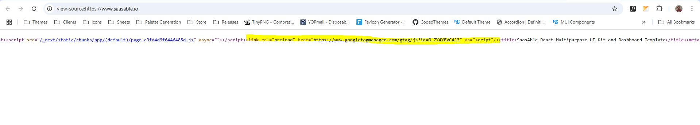

# Analytics

Setting up Google Analytics in SaasAble is very simple. You need to update a tag ID in .env:


```properties
...

## Google Analytics
NEXT_PUBLIC_ANALYTICS_ID=
```


This will render your script in DOM like below:

<figure><figcaption></figcaption></figure>

The value of the tag can be obtained from your Google Analytics account:

<figure><figcaption></figcaption></figure>


