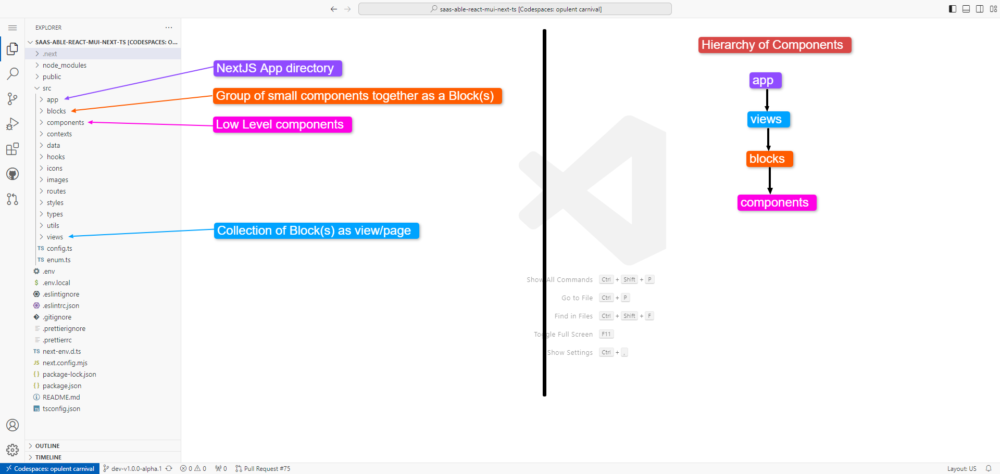

# Folder structure

<figure><figcaption></figcaption></figure>

View folders contain actual themes that are used for specific landings/concepts:

<figure><figcaption></figcaption></figure>


To see which theme you can set at a given time, please refer to the [configuration](../global/config.md) section.


For a more detailed snapshot of the main folders, please check below:

App

Blocks

.png>)

Components

.png>)

